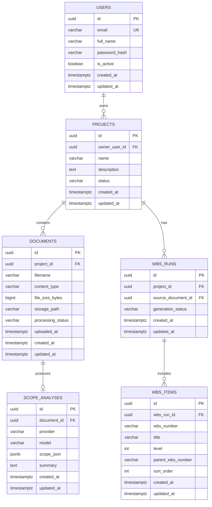

# Database Schema - MVP (v0.1)

## Purpose

This document defines the initial relational schema for Schedule Builder.

It covers:
- Core project data storage (projects, documents, WBS)
- Authentication credential storage (users and password hashes)
- Relationships, constraints, and indexing strategy for MVP

---

## Scope for MVP

The schema supports the current MVP workflow:

1. User registers/logs in
2. User creates a project
3. User uploads a scope document
4. System stores extracted analysis artifacts
5. System generates and stores a WBS for export

Auth is currently in-memory in application code. This schema is the target persistent model for moving auth to the database.

---

## Authentication and Credential Model

Credentials in this system are stored with the following rules:

- Store only password hashes, never plaintext passwords
- Use Argon2 hashes generated by the app (`passlib` + `argon2`)
- Treat JWTs as stateless access tokens signed with `SECRET_KEY`
- Do not store access tokens in DB for MVP
- Optionally store refresh token metadata for revocation (post-MVP)

Current app settings relevant to auth and DB:

- `DATABASE_URL`
- `SECRET_KEY`
- `ALGORITHM`
- `ACCESS_TOKEN_EXPIRE_MINUTES`
- `REFRESH_TOKEN_EXPIRE_DAYS`

---

## Logical Entity Relationship Diagram

---

## Table Specifications

## 1) `users`

Purpose: identity and login credentials.

Columns:
- `id UUID PRIMARY KEY`
- `email VARCHAR(254) NOT NULL UNIQUE`
- `full_name VARCHAR(120) NOT NULL`
- `password_hash TEXT NOT NULL`
- `is_active BOOLEAN NOT NULL DEFAULT TRUE`
- `created_at TIMESTAMPTZ NOT NULL DEFAULT now()`
- `updated_at TIMESTAMPTZ NOT NULL DEFAULT now()`

Constraints and indexes:
- Unique index on lowercased email (`UNIQUE (lower(email))`) for case-insensitive uniqueness
- Optional check for non-empty `full_name`

Notes:
- Map to auth schemas: `UserPublic` excludes `password_hash`
- `password_hash` stores Argon2 encoded hash string

## 2) `projects`

Purpose: top-level container for work products.

Columns:
- `id UUID PRIMARY KEY`
- `owner_user_id UUID NOT NULL REFERENCES users(id) ON DELETE CASCADE`
- `name VARCHAR(200) NOT NULL`
- `description TEXT NULL`
- `status VARCHAR(32) NOT NULL DEFAULT 'draft'`
- `created_at TIMESTAMPTZ NOT NULL DEFAULT now()`
- `updated_at TIMESTAMPTZ NOT NULL DEFAULT now()`

Indexes:
- `INDEX projects_owner_user_id_idx (owner_user_id)`
- `INDEX projects_status_idx (status)`

## 3) `documents`

Purpose: uploaded source files tied to a project.

Columns:
- `id UUID PRIMARY KEY`
- `project_id UUID NOT NULL REFERENCES projects(id) ON DELETE CASCADE`
- `filename VARCHAR(255) NOT NULL`
- `content_type VARCHAR(100) NOT NULL`
- `file_size_bytes BIGINT NOT NULL`
- `storage_path TEXT NOT NULL`
- `processing_status VARCHAR(32) NOT NULL DEFAULT 'uploaded'`
- `uploaded_at TIMESTAMPTZ NOT NULL DEFAULT now()`
- `created_at TIMESTAMPTZ NOT NULL DEFAULT now()`
- `updated_at TIMESTAMPTZ NOT NULL DEFAULT now()`

Indexes:
- `INDEX documents_project_id_idx (project_id)`
- `INDEX documents_processing_status_idx (processing_status)`

## 4) `scope_analyses`

Purpose: normalized storage for AI scope extraction output.

Columns:
- `id UUID PRIMARY KEY`
- `document_id UUID NOT NULL UNIQUE REFERENCES documents(id) ON DELETE CASCADE`
- `provider VARCHAR(32) NOT NULL` (e.g. `anthropic`, `openai`)
- `model VARCHAR(128) NOT NULL`
- `scope_json JSONB NOT NULL`
- `summary TEXT NULL`
- `created_at TIMESTAMPTZ NOT NULL DEFAULT now()`
- `updated_at TIMESTAMPTZ NOT NULL DEFAULT now()`

Indexes:
- `INDEX scope_analyses_document_id_idx (document_id)`
- `GIN INDEX scope_analyses_scope_json_gin (scope_json)` (PostgreSQL)

## 5) `wbs_runs`

Purpose: a generated WBS snapshot/run for a project.

Columns:
- `id UUID PRIMARY KEY`
- `project_id UUID NOT NULL REFERENCES projects(id) ON DELETE CASCADE`
- `source_document_id UUID NULL REFERENCES documents(id) ON DELETE SET NULL`
- `generation_status VARCHAR(32) NOT NULL DEFAULT 'generated'`
- `created_at TIMESTAMPTZ NOT NULL DEFAULT now()`
- `updated_at TIMESTAMPTZ NOT NULL DEFAULT now()`

Indexes:
- `INDEX wbs_runs_project_id_idx (project_id)`
- `INDEX wbs_runs_generation_status_idx (generation_status)`

## 6) `wbs_items`

Purpose: hierarchical WBS entries for one run.

Columns:
- `id UUID PRIMARY KEY`
- `wbs_run_id UUID NOT NULL REFERENCES wbs_runs(id) ON DELETE CASCADE`
- `wbs_number VARCHAR(24) NOT NULL`
- `title VARCHAR(255) NOT NULL`
- `level INTEGER NOT NULL`
- `parent_wbs_number VARCHAR(24) NULL`
- `sort_order INTEGER NOT NULL`
- `created_at TIMESTAMPTZ NOT NULL DEFAULT now()`
- `updated_at TIMESTAMPTZ NOT NULL DEFAULT now()`

Constraints and indexes:
- `UNIQUE (wbs_run_id, wbs_number)`
- Check: `level IN (1, 2)` for MVP
- `INDEX wbs_items_wbs_run_id_idx (wbs_run_id)`
- `INDEX wbs_items_sort_order_idx (wbs_run_id, sort_order)`

---

## Optional Post-MVP Auth Tables

These are not required for MVP auth, but are compatible with current token strategy.

### `refresh_tokens` (optional)

Use when introducing token revocation and session listing.

Columns:
- `id UUID PRIMARY KEY`
- `user_id UUID NOT NULL REFERENCES users(id) ON DELETE CASCADE`
- `token_jti UUID NOT NULL UNIQUE`
- `expires_at TIMESTAMPTZ NOT NULL`
- `revoked_at TIMESTAMPTZ NULL`
- `created_at TIMESTAMPTZ NOT NULL DEFAULT now()`

---

## Migration Plan (Suggested Order)

1. Create `users`
2. Create `projects`
3. Create `documents`
4. Create `scope_analyses`
5. Create `wbs_runs`
6. Create `wbs_items`
7. Add indexes and constraints

Then migrate auth service from in-memory dictionaries to repository/ORM-backed operations.

---

## Mapping to Code Structure

Planned model files:
- `src/schedule_builder/models/user.py`
- `src/schedule_builder/models/project.py`
- `src/schedule_builder/models/document.py`
- `src/schedule_builder/models/wbs.py`

Planned data access/services:
- `src/schedule_builder/repositories/user_repository.py`
- `src/schedule_builder/services/user_service.py`
- `src/schedule_builder/auth/service.py` (switch to DB-backed implementation)

---

## Security Notes

- Do not expose `password_hash` in API responses
- Keep `SECRET_KEY` out of source control and `.env.example` should include a placeholder only
- Enforce TLS in production for all auth endpoints
- Use least-privileged DB credentials in production
